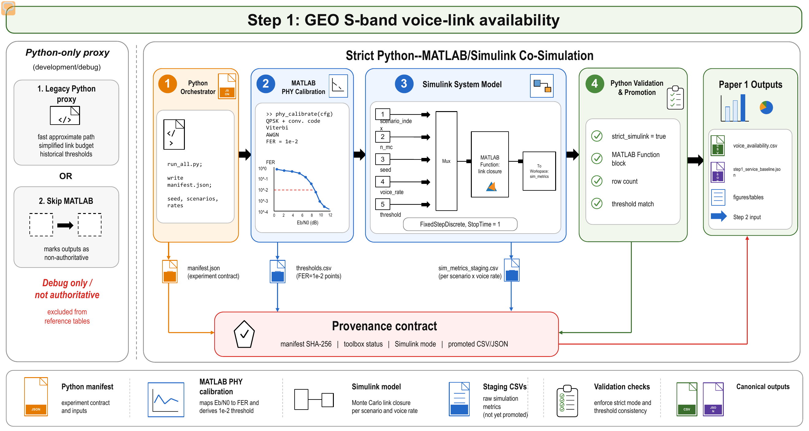

<p align="center">
  <strong>English</strong> · <a href="README.zh-CN.md">简体中文</a>
</p>

<h1 align="center">GEO S-Band VoiceLink</h1>

<p align="center">
  <strong>Open screening toolkit for GEO S-band satellite-phone voice links</strong><br>
  Python, Streamlit, MATLAB, and Simulink workflows for link closure, low-tail capacity, and voice-bearer availability.
</p>

<p align="center">
  <a href="https://www.python.org/"></a>
  <a href="#quick-start"></a>
  <a href="#matlabsimulink-reference"></a>
  <a href="LICENSE"></a>
</p>

<p align="center">
  <a href="#overview">Overview</a> ·
  <a href="#key-results">Results</a> ·
  <a href="#visual-summary">Figures</a> ·
  <a href="#quick-start">Quick Start</a> ·
  <a href="#dashboard-and-pages">Dashboard</a> ·
  <a href="#reproduction">Reproduction</a> ·
  <a href="#matlabsimulink-reference">MATLAB</a> ·
  <a href="#license">License</a>
</p>

> [!IMPORTANT]
> This is a public-parameter screening toolkit. It is not a proprietary handset implementation, field-test dataset, vendor calibration package, or satellite-network access procedure.

<a id="overview"></a>
## Overview

GEO S-Band VoiceLink estimates whether a handheld satellite-phone-style terminal can close a low-rate voice bearer in remote-area scenarios. The workflow models posture loss, shadowing, LOS/NLOS mixing, terrain blockage, residual Doppler, rain loss, and low-tail outage-capacity constraints.

| Goal | Implemented approach | Public boundary |
| --- | --- | --- |
| Screen GEO S-band voice-link closure | Python link-budget, availability, and outage-capacity calculations | Uses public-style proxy parameters, not private measurements |
| Expose low-tail risk | LOS/NLOS mixture compared with average-SNR and single-state baselines | Results are screening references, not vendor certification |
| Keep reference outputs auditable | MATLAB Communications Toolbox threshold calibration and strict Simulink availability model | Full regeneration requires MATLAB, Simulink, and Communications Toolbox |
| Make results easy to inspect | Committed CSV/JSON/PNG/PDF artifacts plus Streamlit and static HTML views | New local outputs are written to ignored `outputs/` |

Normal engineering use does not require MATLAB/Simulink. The MATLAB/Simulink path is needed only when regenerating the promoted reference tables from scratch.

<a id="key-results"></a>
## Key Results

For the 2.4 kbps voice bearer, the LOS/NLOS mixture model gives the following baseline availability:

| Scenario | Availability | P10 Eb/N0 | Median Eb/N0 |
| --- | ---: | ---: | ---: |
| Open plain | 100.00% | 19.48 dB | 22.94 dB |
| Forest edge | 99.29% | 14.67 dB | 22.30 dB |
| Canyon valley | 84.31% | 1.65 dB | 18.91 dB |
| Moving trail | 66.37% | -2.95 dB | 12.75 dB |
| Tent/shelter | 36.07% | -14.48 dB | -0.33 dB |

Average-SNR screening is too coarse for low-tail availability: it over-accepts canyon and moving-trail cases, then hard-rejects tent/shelter. The single-state lognormal model remains too optimistic in persistent NLOS states and overstates the tent/shelter result by 60.45 percentage points. The largest tested sensitivity is NLOS excess loss, with a maximum availability swing of 15.69 percentage points.

See [RESULTS.md](RESULTS.md) for the full result summary and references to committed CSV/PNG/PDF artifacts under `expected_outputs/`.

<a id="visual-summary"></a>
## Visual Summary

<p align="center">
  <a href="expected_outputs/figures/all/step1_python_matlab_simulink_cosimulation_imagegen.png">
    
  </a>
</p>
<p align="center"><em>Figure 1 | Python orchestrates the workflow, while MATLAB/Simulink provides the strict reference availability path.</em></p>

<p align="center">
  <a href="expected_outputs/figures/all/geo_s_band_d2c_voice_link_simulation_flow.png">
    
  </a>
</p>
<p align="center"><em>Figure 2 | Low-tail voice-link screening from public proxy parameters to availability and sensitivity outputs.</em></p>

<details>
<summary><strong>Open additional committed result figures</strong></summary>
<br>

<p align="center">
  <a href="expected_outputs/figures/all/geo_satphone_screening_baseline_comparison.png">
    
  </a>
</p>
<p align="center"><em>Figure 3 | Baseline comparisons show why low-tail LOS/NLOS mixture screening matters.</em></p>

<p align="center">
  <a href="expected_outputs/figures/all/geo_satphone_sensitivity_ranking.png">
    
  </a>
</p>
<p align="center"><em>Figure 4 | NLOS excess loss dominates the tested availability perturbations.</em></p>

<p align="center">
  <a href="expected_outputs/figures/all/geo_satphone_dwell_time_sensitivity.png">
    
  </a>
</p>
<p align="center"><em>Figure 5 | Longer NLOS dwell times increase burst lengths even when stationary LOS probability is fixed.</em></p>

<p align="center">
  <a href="expected_outputs/figures/all/outage_capacity_scenarios.png">
    
  </a>
</p>
<p align="center"><em>Figure 6 | Outage-capacity views summarize scenario-level low-tail penalties.</em></p>

</details>

<a id="quick-start"></a>
## Quick Start

Minimal Python-only screening requires only NumPy:

```bash
git clone https://github.com/rudykon/geo-sband-voicelink.git
cd geo-sband-voicelink

python -m pip install -r requirements-lite.txt
python quick_run.py
```

Run one scenario with an added implementation or channel loss:

```bash
python quick_run.py --scenario canyon --added-loss-db 2
```

Quick-run outputs are written to:

```text
outputs/quick_run/quick_summary.csv
outputs/quick_run/quick_summary.json
outputs/quick_run/quick_summary.md
```

Use `--no-write` for console-only screening and `--list-scenarios` to inspect supported aliases.

<a id="dashboard-and-pages"></a>
## Dashboard And Pages

Launch the Streamlit engineering dashboard:

```bash
python -m pip install -r requirements-dashboard.txt
streamlit run app.py
```

The dashboard supports scenario selection, proxy-parameter sliders, availability and baseline comparison, sensitivity ranking, and committed figure viewing.

Static and notebook views:

- [docs/index.html](docs/index.html) is the GitHub Pages result page. Enable GitHub Pages from the `docs/` folder to publish it.
- [examples/quick_start.ipynb](examples/quick_start.ipynb) provides an editable notebook workflow for parameter changes and table inspection.

<a id="reproduction"></a>
## Reproduction

Install the full optional Python environment:

```bash
python -m venv .venv
source .venv/bin/activate
python -m pip install -r requirements.txt
```

Run the complete reference workflow:

```bash
python run_all.py
```

This invokes Python calculations, MATLAB/Simulink reference co-simulation, promotion of canonical CSV/JSON outputs, and screening-analysis figure generation. Newly generated artifacts are written under ignored `outputs/`:

```text
outputs/
├── quick_run/
├── data/
├── figures/
└── archive/
```

`python run_all.py --skip-reference-cosim` is development-only. It runs Python-only scripts and marks the output as non-reference because screening artifacts that require MATLAB/Simulink reference outputs are skipped.

<a id="matlabsimulink-reference"></a>
## MATLAB/Simulink Reference

The reference path requires MATLAB, Simulink, and Communications Toolbox. MATLAB is detected from `MATLAB_EXE`, then `matlab` on `PATH`, then `D:\matlab\bin\matlab.exe`.

From MATLAB:

```matlab
cd("matlab_voice_link")
run_voice_link_reference_cosim("../outputs/data/reference_cosim/voice_link_cosim_manifest.json")
```

Normally `run_all.py` creates the manifest and invokes this entry point through `matlab.exe -batch`. Expected staging outputs are written to `outputs/data/reference_cosim/`, and Python promotes canonical outputs to `outputs/data/voice_link/`. See [MATLAB_SIMULINK.md](MATLAB_SIMULINK.md) and [matlab_voice_link/README.md](matlab_voice_link/README.md) for details.

<a id="repository-map"></a>
## Repository Map

| Path | Purpose |
| --- | --- |
| `quick_run.py` | One-command Python-only voice-link screening entry point |
| `run_all.py` | Full Python + MATLAB/Simulink reference workflow |
| `app.py` | Streamlit dashboard |
| `src/` | Link budget, outage capacity, reference-output promotion, and screening analysis |
| `matlab_voice_link/` | MATLAB/Simulink PHY calibration and reference availability scripts/models |
| `expected_outputs/` | Committed reference CSV/JSON/PNG/PDF outputs |
| `docs/` | Static GitHub Pages result page and assets |
| `examples/` | Notebook quick-start workflow |
| `RESULTS.md` | Detailed result summary |
| `PUBLIC_RELEASE.md` | Public-release scope notes |

<a id="scope"></a>
## Scope

Included:

- Public-parameter Python screening workflow.
- Streamlit dashboard and static HTML result page.
- MATLAB/Simulink reference scripts and models.
- Selected committed reference outputs under `expected_outputs/`.

Excluded:

- Proprietary handset implementation details.
- Private field-test measurements or vendor calibration data.
- Local regenerated outputs under `outputs/`.
- Legacy local artifacts under `archive/`.

Numerical values can change slightly across NumPy/SciPy/Matplotlib versions, but the qualitative rankings should remain stable.

<a id="license"></a>
## License

This project is released under the [MIT License](LICENSE).
