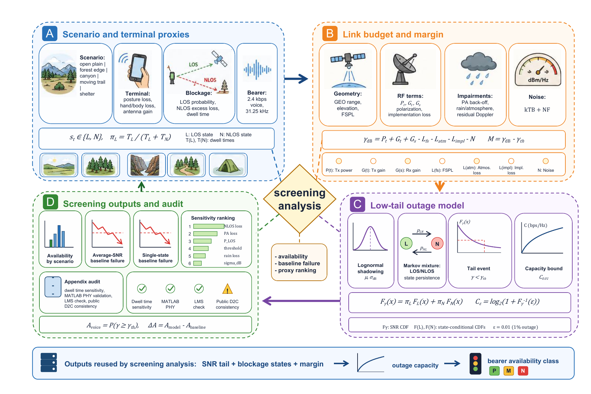

<p align="center">
  <a href="README.md">English</a> · <strong>简体中文</strong>
</p>

<p align="center">
  
</p>

<h1 align="center">GEO S-Band VoiceLink</h1>

<p align="center">
  <strong>面向 GEO S-band 卫星手机语音链路的开源筛选工具</strong><br>
  一套用于链路闭合、低尾容量和语音 bearer 可用性评估的 Python、Streamlit、MATLAB 与 Simulink 工作流。
</p>

<p align="center">
  <a href="https://www.python.org/"></a>
  <a href="#quick-start"></a>
  <a href="#matlabsimulink-reference"></a>
  <a href="LICENSE"></a>
</p>

<p align="center">
  <a href="#overview">项目概览</a> ·
  <a href="#key-results">关键结果</a> ·
  <a href="#visual-summary">图示</a> ·
  <a href="#quick-start">快速开始</a> ·
  <a href="#dashboard-and-pages">Dashboard</a> ·
  <a href="#reproduction">复现</a> ·
  <a href="#matlabsimulink-reference">MATLAB</a> ·
  <a href="#license">许可证</a>
</p>

> [!IMPORTANT]
> 本项目是公开参数筛选工具，不是专有手机实现、外场实测数据集、厂商标定包或卫星入网流程。

<a id="overview"></a>
## 项目概览

GEO S-Band VoiceLink 用于估计手持卫星电话形态的终端，在远程地区场景下能否闭合低速率语音 bearer。工作流考虑姿态损失、阴影衰落、LOS/NLOS 混合、地形遮挡、残余 Doppler、雨衰和低尾中断容量约束。

| 目标 | 已实现方法 | 公开边界 |
| --- | --- | --- |
| 筛选 GEO S-band 语音链路闭合 | Python 链路预算、可用性和中断容量计算 | 使用公开风格代理参数，不使用私有测量数据 |
| 暴露低尾风险 | LOS/NLOS 混合模型与平均 SNR、单状态 baseline 对比 | 结果是筛选参考，不是厂商认证 |
| 保持参考输出可审计 | MATLAB Communications Toolbox 门限标定和严格 Simulink 可用性模型 | 完整重生成需要 MATLAB、Simulink 和 Communications Toolbox |
| 便于查看结果 | 已提交 CSV/JSON/PNG/PDF，另有 Streamlit 与静态 HTML | 新的本地输出写入被忽略的 `outputs/` |

普通工程使用不需要 MATLAB/Simulink。只有当需要从头重新生成已提升的参考表格时，才需要 MATLAB/Simulink 路径。

<a id="key-results"></a>
## 关键结果

在 2.4 kbps 语音 bearer 设置下，LOS/NLOS 混合模型得到的基线可用性如下：

| 场景 | 可用性 | P10 Eb/N0 | Median Eb/N0 |
| --- | ---: | ---: | ---: |
| Open plain | 100.00% | 19.48 dB | 22.94 dB |
| Forest edge | 99.29% | 14.67 dB | 22.30 dB |
| Canyon valley | 84.31% | 1.65 dB | 18.91 dB |
| Moving trail | 66.37% | -2.95 dB | 12.75 dB |
| Tent/shelter | 36.07% | -14.48 dB | -0.33 dB |

平均 SNR 筛选对低尾可用性过于粗糙：它会过度接受峡谷和移动路径场景，又会直接拒绝帐篷/遮挡场景。单状态 lognormal 模型在持续 NLOS 状态下仍过于乐观，并在帐篷/遮挡场景中高估 60.45 个百分点。测试参数中影响最大的是 NLOS excess loss，最大可用性变化为 15.69 个百分点。

更完整的结果说明见 [RESULTS.md](RESULTS.md)，已提交的 CSV/PNG/PDF 参考输出位于 `expected_outputs/`。

<a id="visual-summary"></a>
## 图示概览

<p align="center">
  <a href="expected_outputs/figures/all/Step1_GEO_SBand_CoSimulation_Workflow.png">
    
  </a>
</p>
<p align="center"><em>图 1｜Python 负责编排工作流，MATLAB/Simulink 提供严格参考可用性路径。</em></p>

<p align="center">
  <a href="expected_outputs/figures/all/GEO_SBand_Voice_Link_Screening_Workflow_Refined.png">
    
  </a>
</p>
<p align="center"><em>图 2｜从公开代理参数到可用性与灵敏度输出的低尾语音链路筛选流程。</em></p>

<details>
<summary><strong>展开更多已提交结果图</strong></summary>
<br>

<p align="center">
  <a href="expected_outputs/figures/all/geo_satphone_screening_baseline_comparison.png">
    
  </a>
</p>
<p align="center"><em>图 3｜Baseline 对比说明低尾 LOS/NLOS 混合筛选的必要性。</em></p>

<p align="center">
  <a href="expected_outputs/figures/all/geo_satphone_sensitivity_ranking.png">
    
  </a>
</p>
<p align="center"><em>图 4｜NLOS excess loss 主导测试范围内的可用性扰动。</em></p>

<p align="center">
  <a href="expected_outputs/figures/all/geo_satphone_dwell_time_sensitivity.png">
    
  </a>
</p>
<p align="center"><em>图 5｜在固定稳态 LOS 概率下，更长 NLOS dwell time 会增加突发长度。</em></p>

<p align="center">
  <a href="expected_outputs/figures/all/outage_capacity_scenarios.png">
    
  </a>
</p>
<p align="center"><em>图 6｜中断容量视角汇总场景级低尾惩罚。</em></p>

</details>

<a id="quick-start"></a>
## 快速开始

最小 Python-only 筛选只需要 NumPy：

```bash
git clone https://github.com/rudykon/geo-sband-voicelink.git
cd geo-sband-voicelink

python -m pip install -r requirements-lite.txt
python quick_run.py
```

带额外实现或信道损耗运行单个场景：

```bash
python quick_run.py --scenario canyon --added-loss-db 2
```

快速运行输出会写入：

```text
outputs/quick_run/quick_summary.csv
outputs/quick_run/quick_summary.json
outputs/quick_run/quick_summary.md
```

使用 `--no-write` 可只在终端查看结果，使用 `--list-scenarios` 可查看支持的场景别名。

<a id="dashboard-and-pages"></a>
## Dashboard 与静态页

启动 Streamlit 工程 dashboard：

```bash
python -m pip install -r requirements-dashboard.txt
streamlit run app.py
```

Dashboard 支持选择场景、调整代理参数、查看可用性和 baseline 对比、灵敏度排序，以及浏览已提交图件。

静态和 notebook 入口：

- [docs/index.html](docs/index.html) 是 GitHub Pages 结果页。仓库设置中把 GitHub Pages 来源设为 `docs/` 即可发布。
- [examples/quick_start.ipynb](examples/quick_start.ipynb) 提供可编辑 notebook 工作流，便于改参数和查看表格。

<a id="reproduction"></a>
## 复现

安装完整可选 Python 环境：

```bash
python -m venv .venv
source .venv/bin/activate
python -m pip install -r requirements.txt
```

运行完整参考流程：

```bash
python run_all.py
```

该流程会运行 Python 计算、MATLAB/Simulink 参考联合仿真、规范 CSV/JSON 输出提升和筛选分析图件生成。新的本地工件写入被忽略的 `outputs/`：

```text
outputs/
├── quick_run/
├── data/
├── figures/
└── archive/
```

`python run_all.py --skip-reference-cosim` 仅用于开发调试。它会运行 Python-only 脚本，并把输出标记为非参考结果，因为依赖 MATLAB/Simulink 参考输出的筛选分析工件会被跳过。

<a id="matlabsimulink-reference"></a>
## MATLAB/Simulink 参考路径

参考路径需要 MATLAB、Simulink 和 Communications Toolbox。MATLAB 检测顺序为 `MATLAB_EXE`、`matlab` on `PATH`、`D:\matlab\bin\matlab.exe`。

在 MATLAB 中运行：

```matlab
cd("matlab_voice_link")
run_voice_link_reference_cosim("../outputs/data/reference_cosim/voice_link_cosim_manifest.json")
```

通常由 `run_all.py` 自动生成 manifest 并通过 `matlab.exe -batch` 调用该入口。预期中间输出写入 `outputs/data/reference_cosim/`，随后由 Python 提升规范输出到 `outputs/data/voice_link/`。详见 [MATLAB_SIMULINK.md](MATLAB_SIMULINK.md) 和 [matlab_voice_link/README.md](matlab_voice_link/README.md)。

<a id="repository-map"></a>
## 项目结构

| 路径 | 作用 |
| --- | --- |
| `quick_run.py` | 一键 Python-only 语音链路筛选入口 |
| `run_all.py` | 完整 Python + MATLAB/Simulink 参考流程 |
| `app.py` | Streamlit dashboard |
| `src/` | 链路预算、中断容量、参考输出提升和筛选分析 |
| `matlab_voice_link/` | MATLAB/Simulink PHY 标定和参考可用性脚本/模型 |
| `expected_outputs/` | 已提交参考 CSV/JSON/PNG/PDF 输出 |
| `docs/` | 静态 GitHub Pages 结果页和资源 |
| `examples/` | Notebook 快速开始工作流 |
| `RESULTS.md` | 详细结果摘要 |
| `PUBLIC_RELEASE.md` | 公开发布范围说明 |

<a id="scope"></a>
## 适用边界

已包含：

- 公开参数 Python 筛选工作流。
- Streamlit dashboard 与静态 HTML 结果页。
- MATLAB/Simulink 参考脚本和模型。
- `expected_outputs/` 下选定参考输出。

未包含：

- 专有手机实现细节。
- 私有外场测量或厂商标定数据。
- `outputs/` 下的本地重生成产物。
- `archive/` 下的本地历史工件。

不同 NumPy/SciPy/Matplotlib 版本下数值可能有轻微变化，但主要排序和结论应保持稳定。

<a id="license"></a>
## 许可证

本项目采用 [MIT License](LICENSE)。

